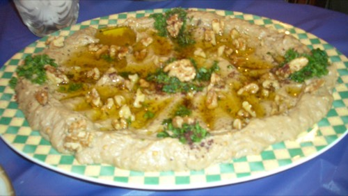

# Baba ganoush

Smoky charred-eggplant-and-tahini spread — baba ganoush's chickpea-free cousin.
A lunch-table staple: scoop onto bread, spoon beside salads, or set it out next
to the [hummus](hummus.md) as a second dip so the spread has more than one note.

**Tags:** cuisine: Levantine · course: lunch / spread / grazing ·
dietary: vegan, GF · make-ahead: yes

> **A naming note.** What most people picture as "baba ganoush" — creamy, with
> tahini — is strictly **mutabal** in the Levant. Ottolenghi (and others) reserve
> **baba ganoush** for a lighter, chopped-vegetable-and-herb version with *no
> tahini*. This card writes the creamy tahini version people expect; the herby
> one is under [Variations](#garnishes--variations).

## Yields & scaling

- **Base batch:** ~1.1 kg finished dip, from **2 kg raw eggplant**.
- **Sized for this batch:** a **40-person lunch** where it's a side / spread and
  **about half take some** → ~18 servings at ~60 g. Generous; if it sits beside
  hummus and other spreads, the same batch stretches further.
- **Scaling:** the *mixing* scales linearly — multiply up. The real ceiling is
  **charring the eggplant**, not the recipe: a broiler or oven does one tray at a
  time, so for big numbers you char in waves (or use a grill, which does more at
  once and tastes better). Colander space to drain is the second bottleneck.
- **Tahini = richness dial:** the trusted sources disagree wildly here, from
  America's Test Kitchen's barely-there 2 tbsp per 900 g eggplant to Ottolenghi's
  tahini-rich mutabal. This batch uses a **middle 140 g** for a creamy but still
  smoke-forward dip. Push to **200 g** for full mutabal richness, or drop to
  **60–80 g** to let the char dominate (the ATK style) and stretch the budget —
  tahini is the pricey ingredient.

## Equipment

- A way to char eggplant whole: a **gas flame / grill** (best — that's where the
  smoke comes from) or an **oven broiler / very hot oven** (works, milder smoke)
- Colander or sieve (to drain the flesh — don't skip this)
- Food processor *or* just a bowl and a fork — this dip wants to stay a little
  chunky, so a fork is genuinely fine
- Citrus juicer

## Ingredients

_Per base batch (~1.1 kg, ~18 side servings)._

| Ingredient | Amount | On the shelf as (DA · DE · FR · NL) |
|---|---|---|
| Eggplant (aubergine) | 2 kg (about 8 medium) | aubergine · Aubergine · aubergine · aubergine |
| Tahini, well stirred | 140 g (see dial above) | — |
| Lemons (for juice) | ~60 ml juice (~2 lemons) | citron · Zitrone · citron · citroen |
| Garlic | 2 cloves | hvidløg · Knoblauch · ail · knoflook |
| Fine salt | 1.5–2 tsp, to taste | — |
| Ground cumin (optional) | a pinch | spidskommen · Kreuzkümmel · cumin · komijn |
| Olive oil | ~3 tbsp to mix + more to finish | — |

> **Two supermarket traps, same as for [hummus](hummus.md):**
> - **Cumin ≠ caraway.** Danish **spidskommen** / German **Kreuzkümmel** are
>   cumin; plain *kommen* / *Kümmel* is caraway — a totally different, aniseedy
>   spice that wrecks the dish. (Cumin is optional here anyway — a pinch at most.)
> - **Tahini naming:** sold as "tahini", but you may see **tahin** (DA/DE/NL) or
>   **purée de sésame** (FR). Stir the jar thoroughly — the oil separates to the
>   top and the paste sets rock-hard at the bottom.

## Method

1. **Char the eggplant** until the skin is blackened and blistered all over and
   the flesh has *completely* collapsed — no firmness left anywhere. **Prick each
   one a few times first** with a fork or knife so trapped steam escapes instead
   of bursting it.
   - **On a gas flame or grill:** sit them right over the flame, turning with
     tongs as each side chars, ~15–25 min. This is where the signature smoky
     flavour comes from.
   - **Under a broiler / in a hot oven:** broil close to the element (or roast at
     240 °C / 465 °F) on a foil-lined tray, turning a few times, ~40–50 min.
     Milder smoke, but it works.
   Done means floppy and caved-in, not just soft. Underdone eggplant tastes raw
   and spongy, so err toward too far.
2. **Cool, then peel.** When cool enough to handle, split each one open and scoop
   the flesh into a colander; discard the blackened skin and the stem. A few
   flecks of char are good flavour — you don't need it spotless.
3. **Drain — don't skip this.** Let the flesh sit in the colander **at least
   30 min** (set it over a bowl or in the sink). Eggplant is mostly water, and
   that water is bitter and would make the dip soupy; draining it is what makes
   the difference between a watery dip and a thick, rich one. Press gently at the
   end to push more out.
4. **Mellow the garlic:** crush or grate the garlic, mix with the lemon juice and
   ½ tsp salt, and **let it stand 10 min.** The acid tames the raw garlic's harsh
   hot bite so you get the flavour without the lingering burn. (Strain the garlic
   solids out afterwards if you want it smoother; leaving them in is fine too.)
5. **Mix — keep it chunky.** Roughly chop the drained eggplant, then mix in the
   garlic-lemon, **tahini**, ~3 tbsp olive oil, the cumin if using, and the rest
   of the salt. Mash with a fork or pulse the processor in short bursts — stop
   while it still has some texture. Unlike hummus, baba ganoush is meant to be a
   little rustic, not a smooth purée; over-blending turns it gluey and pale.
6. **Taste and adjust.** It should taste bright and savoury — add salt, lemon, or
   a thread more tahini until it does. If it's stiff, loosen with a little more
   olive oil.
7. **Rest:** chill 30 min+ for the flavours to settle, then bring back toward
   room temperature before serving — fridge-cold, it's stiff and flat.

## Garnishes / variations

Spread into a shallow bowl, make a well or swoosh, pool good olive oil in it,
then pick a few:

- **Classic:** olive oil + chopped **parsley**; a dusting of **smoked paprika**
  or **sumac**; a scatter of **pomegranate** seeds for sharpness and colour.
- **Crunchy:** toasted **pine nuts** or **walnuts**.
- **Mutabal (richer):** push the tahini to ~200 g and stir in a couple of spoons
  of **thick yogurt** — luxurious, no longer vegan.
- **Ottolenghi-style baba ganoush (no tahini, lighter):** skip the tahini
  entirely. Fold the drained smoky eggplant with finely chopped **red and green
  pepper, tomato, spring onion, and parsley**, dressed with **lemon, olive oil,
  and pomegranate molasses**, topped with pomegranate seeds. A fresh, chunky
  salad-dip rather than a creamy one.
- **Make it a meal (vegan base + protein on top):** like hummus, spoon over
  **spiced sautéed lamb or beef mince** with pine nuts — the base bowl stays
  vegan, the meat goes on one half or on the side, so one bowl feeds everyone.

## Make-ahead / cross-day notes

- **Keeps 3–4 days** covered in the fridge; the smoky flavour deepens overnight.
  Stir and bring back to room temperature before serving.
- **Char ahead:** the slow part is charring and draining. Do that the day before,
  refrigerate the drained flesh, and the final mix takes minutes — handy when an
  oven or grill is fought over on the day.
- **Freezes** reasonably (texture loosens a little): freeze plain without
  garnish, thaw in the fridge, re-mix with a splash of oil.
- **Cross-day reuse:** leftover baba ganoush is next day's sandwich spread,
  stirred through pasta or grains, or thinned with lemon and oil into a dressing.

## References

Cross-checked against these trusted sources (see the [sourcing rule](../CLAUDE.md)
and [`trusted-sources.md`](trusted-sources.md)):

- [Yotam Ottolenghi — Mutabal (burnt aubergine with tahini)](https://ottolenghi.co.uk/pages/recipes/baba-ganoush-burnt-aubergine-tahini) — the creamy tahini version this card is based on.
- [Yotam Ottolenghi — Baba Ganoush (the lighter, herb-and-veg version)](https://ottolenghi.co.uk/pages/recipes/baba-ganoush) — source for the no-tahini variation.
- [America's Test Kitchen — Baba Ghanoush](https://www.americastestkitchen.com/recipes/14009-baba-ghanoush) — the char-and-drain technique and the light-tahini end of the dial.
- [Michael Solomonov — Baba Ghanoush (Food Network)](https://www.foodnetwork.com/fnk/recipes/baba-ghanoush-7151767) — eggplant-forward ratio.

---

Sample photo: *Baba Ghanoush* by
[Basel15](https://commons.wikimedia.org/wiki/File:Baba_Ghanoush.jpg) at English
Wikipedia, released into the **public domain**. Resized for the web.
