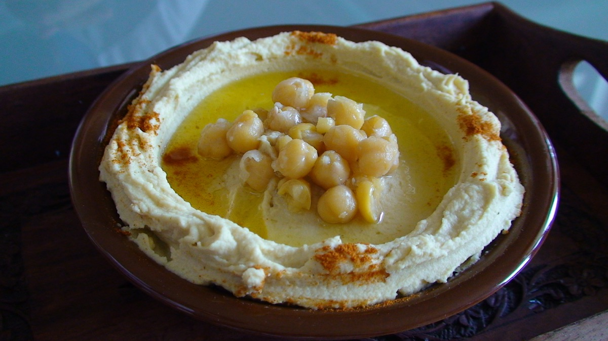

# Hummus

Classic chickpea-and-tahini spread. A lunch-table staple: scoop onto bread,
spoon beside salads, or use as the vegan base under a spiced-meat topping.

**Tags:** cuisine: Levantine · course: lunch / spread / grazing ·
dietary: vegan-base, GF · make-ahead: yes

## Yields & scaling

- **Base batch:** ~1.2 kg finished hummus.
- **Sized for this batch:** a **40-person lunch** where it's a side / spread and
  **about half take some** → ~20 servings at ~60 g each. Generous; if it's one
  of several spreads, the same batch stretches further.
- **Scaling:** scales linearly — just multiply. The real ceiling is your food
  processor bowl, not the recipe; blend in batches rather than overfilling.
  Quantities below are easy to double/halve.

## Equipment

- Large pot (for cooking the chickpeas)
- Food processor (a blender works but you'll have to scrape and loosen more)
- Sieve / colander
- Citrus juicer

## Ingredients

_Per base batch (~1.2 kg, ~20 side servings)._

- **350 g dried chickpeas** (yields ~850 g cooked) — see note for canned
- **1 tsp baking soda** for the soak + **1 tsp** for the cooking water
- **200 g tahini**, well stirred (see **Tahini choice** below)
- **75 ml lemon juice** (~2 lemons), plus more to taste
- **3 cloves garlic**, crushed
- **1.5–2 tsp fine salt**, to taste
- **1 tsp ground cumin** (optional)
- **60–120 ml ice water** or reserved cooking liquid (aquafaba), to loosen
- **Olive oil**, for blending and finishing

> **Shortcut with canned:** skip the soak/cook and use **~3 × 400 g cans**
> (~700–750 g drained). Simmer the drained chickpeas 15–20 min with 1 tsp
> baking soda to soften and loosen the skins before blending — it's the single
> biggest step toward smooth hummus from a can.

## Method

1. **Soak (night before):** cover the dried chickpeas with plenty of cold
   water, stir in 1 tsp baking soda, leave 8–12 h. They'll roughly double.
   Drain and rinse.
2. **Cook:** cover generously with fresh water, add 1 tsp baking soda, bring to
   a boil, then simmer **45–60 min** until *very* soft — they should crush to
   paste between two fingers with no resistance. Skim the foam and loose skins.
   Slightly overcooked is exactly right here. Drain, **reserving the cooking
   liquid**.
3. **Optional, for the smoothest result:** rub the warm chickpeas in a towel /
   swish in a bowl of water to slip off the skins. Worth it for a showpiece
   bowl; skippable for a working lunch spread.
4. **Blend the base:** set aside a handful of whole chickpeas for garnish.
   Process the rest while still warm with the garlic, salt, cumin and lemon
   juice until stiff and grainy, ~1 min.
5. **Add tahini:** add the tahini, blend again. It'll seize and thicken — don't
   panic.
6. **Loosen & whip:** with the motor running, trickle in **ice water** (or
   reserved cooking liquid) a little at a time until it turns pale, smooth and
   light. Run it a full 2–3 min longer than feels necessary — long blending is
   what makes it fluffy. Taste and adjust salt / lemon. It should taste
   slightly over-seasoned cold, since chilling mutes it.
7. **Rest:** ideally chill 30 min+ for the flavours to settle. Bring back
   toward room temperature before serving — fridge-cold hummus is stiff and
   flat.

## Tahini choice

Tahini is the make-or-break ingredient — more than the chickpeas.

- **Go for smooth, pourable, single-origin tahini** (Lebanese, Palestinian, or
  Ethiopian-seed brands such as Al Arz, Al Wadi, Karawan, Soom, Seed+Mill).
  It should pour like thick cream and taste nutty, not bitter.
- **Avoid** cheap supermarket tahini that's stiff, claggy, or harshly bitter —
  it drags the whole bowl down and no amount of lemon rescues it.
- **Always stir the jar thoroughly** — the oil separates and sits on top; the
  paste at the bottom is rock-hard. A fully stirred jar is non-negotiable.
- **Light vs dark:** standard hummus uses **light (hulled) tahini**. Dark /
  unhulled is more bitter and earthy — interesting, but not the default.

## Garnish ideas

Hummus is a blank canvas. Build a well or swoosh, pool olive oil in it, then
pick a few:

- **Classic:** good olive oil + a dusting of **paprika** or **sumac**, the
  reserved whole chickpeas, chopped **parsley**.
- **Nutty/crunchy:** toasted **pine nuts** or **dukkah**; **za'atar**.
- **Heat:** **Aleppo pepper**, or a drizzle of chilli / chilli-crisp oil.
- **Fresh/sharp:** **pomegranate** seeds, a little lemon zest.
- **Make it a meal (protein add-on):** spoon over **spiced sautéed lamb or beef
  mince** with pine nuts (*hummus kawarma*), or top with crisp falafel. This is
  the vegan-base-plus-protein pattern — the base bowl stays vegan, the meat goes
  on one half or on the side.

## Make-ahead / cross-day notes

- **Keeps 3–4 days** covered in the fridge; flavour deepens overnight. Stir and
  re-loosen with a splash of water before serving.
- **Freezes** well for a month — freeze plain (no garnish), thaw in the fridge,
  re-whip with a little water and oil.
- **Cross-day reuse:** leftover hummus is next day's sandwich spread, a binder
  for veggie patties, or thinned with lemon and water into a salad dressing.
- **Batch the chickpeas:** cook extra and reserve some whole for salads, soups,
  or roasting — the cooking liquid (aquafaba) is itself useful.

---

Sample photo: *Lebanese style hummus* by
[Beyrouthhh](https://commons.wikimedia.org/wiki/File:Lebanese_style_hummus.jpg)
at English Wikipedia, [CC BY 3.0](https://creativecommons.org/licenses/by/3.0).
Resized for the web.
