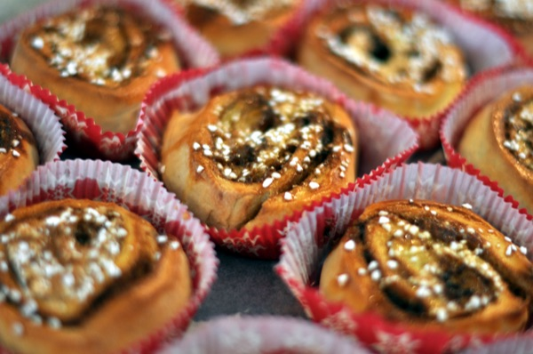

# Kanelsnegle (Danish cinnamon rolls)

<!--  -->

Soft, cardamom-scented yeast buns rolled around a gooey butter-sugar filling —
the Danish *kanelsnegl* ("cinnamon snail"). Built for the afternoon break: a
quick-rising dough you can start after lunch and serve warm with coffee by four.

**Tags:** cuisine: Danish / Nordic · course: 4 o'clock (afternoon break) /
baking · dietary: vegetarian (egg + dairy) · make-ahead: yes

## Timing — start 13:00, eat 16:00

This dough rises fast (plenty of yeast, a warm spot), so two short rises still
fit a three-hour window with margin to spare:

| Time | Step |
|---|---|
| 13:00 | Mix and knead the dough (~20 min) |
| 13:20 | First rise, 30–45 min in a warm spot |
| 14:05 | Roll, fill, cut, arrange in pans |
| 14:30 | Second rise, 30–40 min |
| 15:10 | Bake ~15–20 min |
| 15:30 | Cool a little, glaze |
| ~15:45 | Serve warm |

If a rise runs slow (cold kitchen), it only eats into the margin — the buns are
forgiving. A warmer spot speeds both rises; see the warm-spot note in the method.

## Yields & scaling

- **Base batch:** 1 kg flour → **~24 generous buns** (afternoon-break size).
- **Scaling:** scales cleanly — multiply every ingredient. On the **Ankarsrum**
  (rated for ~5 kg dough / 1.5 L liquid per batch) this dough goes to **~2.5 kg
  flour — about 2.5× the base, ~60 buns — in a single mix**, which is a whole
  50-ish person break in one go. That's the Ankarsrum's whole point: the open
  bowl and roller handle heavy dough a tilt-head/planetary mixer can't (those
  cap around 1–1.5 kg flour and need batching). Once you're past one Ankarsrum
  load — say feeding 100 — the binding limit becomes **oven and tray space, and
  somewhere big enough to roll out**, not the mixer. Buns bake in ~15–20 min, so
  one oven turns over several trays inside the break.
- **Per head:** one bun each covers a break; allow ~1.5 if it's the only thing
  on the table. So 1 base batch ≈ 16–24 people.
- **The cheap win:** flour, sugar, butter, yeast — all inexpensive. The cost
  barely moves with scale, which makes this a strong big-crowd treat.

## Equipment

- Stand mixer — strongly preferred at this scale; hand-kneading 1 kg of enriched
  dough is hard work (doable, just tiring). The kitchen's **Ankarsrum** is ideal
  here: its roller/scraper takes far bigger dough loads than a planetary mixer
  (see scaling)
- Rolling pin
- A length of unflavoured **dental floss** or thin string — the Danish trick for
  cutting the log without squashing it (see method)
- 2–3 large baking sheets or 9×13" pans, plus parchment

## Ingredients

_Per base batch (1 kg flour, ~24 buns)._

### Dough

| Ingredient | Amount | On the shelf as (DA · DE · NL) |
|---|---|---|
| Wheat flour (plain/bread) | 1000 g | hvedemel · Weizenmehl · tarwebloem |
| Milk, lukewarm | 400 ml | mælk · Milch · melk |
| Butter, softened | 150 g | smør · Butter · boter |
| Eggs | 3 | æg · Eier · eieren |
| Sugar | 100 g | sukker · Zucker · suiker |
| Fresh yeast *or* instant dry yeast | 50 g fresh **or** 18 g (2 sachets) instant | gær · Hefe · gist |
| Ground cardamom | 2–3 tsp | stødt kardemomme · gemahlener Kardamom · gemalen kardemom |
| Fine salt | 10 g (~1¾ tsp) | salt · Salz · zout |

### Filling — *remonce* (base: classic cinnamon)

| Ingredient | Amount | On the shelf as (DA · DE · NL) |
|---|---|---|
| Butter, soft | 200 g | smør · Butter · boter |
| Brown sugar (muscovado is best) | 250 g | brun farin / muscovado · brauner Zucker · bruine basterdsuiker |
| Ground cinnamon | 2–3 tbsp | kanel · Zimt · kaneel |

### Glaze (optional — see icing options)

| Ingredient | Amount | On the shelf as (DA · DE · NL) |
|---|---|---|
| Icing sugar | ~200 g | flormelis · Puderzucker · poedersuiker |
| Water (or milk) | a few tsp, to a thick drizzle | — |

> **Three supermarket traps worth the warning:**
> - **Cardamom is the signature, don't skip it.** It's what makes these taste
>   Danish rather than generic. Whole pods ground fresh (crush, sieve out the
>   husks) are dramatically more aromatic than old pre-ground — worth it if you
>   have a mortar.
> - **`farin` in Denmark is soft brown sugar**, not white. **`flormelis`** is
>   icing/powdered sugar. Don't mix them up.
> - **Fresh yeast (`gær`)** is sold as a 50 g block in the supermarket fridge in
>   Denmark and Germany — handy, since one block *is* a base batch. Instant dry
>   yeast keeps in the cupboard and works just as well; the conversion is in the
>   table.

## Method

1. **Warm the milk** to lukewarm — comfortably warm to a fingertip, ~37 °C, not
   hot. Too hot kills the yeast; cold just rises slowly. If using **fresh
   yeast**, crumble it into the milk and stir to dissolve. If using **instant
   dry yeast**, skip this — it goes straight in with the flour.
2. **Make the dough.** In the mixer bowl combine the flour, sugar, cardamom,
   salt (and instant yeast if using). Add the milk, eggs, and softened butter.
   Knead on low–medium with the dough hook **5–10 min** until smooth, elastic,
   and slightly tacky. **Hold back the last of the flour if you need to — the
   dough should stay soft and a touch sticky, not dry.** Extra flour is the
   commonest way to dry, dense buns.
3. **First rise.** Cover the bowl and leave in a **warm spot 30–45 min**, until
   puffy and roughly doubled. Warm spot = the trick for speed: an oven with just
   the light on, near (not on) a warm hob, or a sunny windowsill. Cold rooms
   roughly double the time.
4. **Make the remonce** while it rises. Beat the soft butter, brown sugar, and
   cinnamon to a smooth, spreadable paste. Creaming it (rather than scattering
   dry sugar) gives an even, gooey filling that stays put instead of leaking out.
5. **Roll out.** Tip the dough onto a lightly floured surface and roll into a
   large rectangle, roughly **3–4 mm thick** (about 40 × 50 cm for a base batch;
   split into two if your surface is small).
6. **Fill.** Spread the remonce evenly over the dough, **leaving a clean 2–3 cm
   strip bare along one long edge** — that dry strip seals the seam.
7. **Roll up** from the filled long edge into a tight log, finishing on the bare
   strip so it seals underneath.
8. **Cut.** Slide a length of dental floss/string under the log, cross the ends
   over the top, and pull — it slices clean through without squashing the
   spiral (a knife drags and flattens it). Cut **~3 cm thick**, ~24 pieces.
9. **Pan them.** Set cut-side up on parchment-lined sheets. Spaced apart =
   crisper sides; nestled close together in a pan = soft, pull-apart sides
   (the usual Danish way). Either is good.
10. **Second rise**, covered, **30–40 min** in the warm spot, until puffy.
    Meanwhile heat the oven to **200 °C** (convection/varmluft) or **220 °C**
    conventional.
11. **Bake ~15–20 min** until golden and risen. They're done when deep golden
    and the centre buns feel set, not doughy (≈96 °C inside if you have a
    thermometer). Don't overbake — pulling them while just set keeps them soft.
12. **Glaze.** Let them cool until just warm, not hot — glaze on hot buns melts
    and runs straight off. Stir the icing sugar with a few teaspoons of water to
    a thick drizzle and zigzag it over. Serve warm.

## Filling options

The remonce is the canvas. Per base batch, swap or add to the classic:

- **Cardamom (Nordic *kardemommesnurr*):** add 1 tbsp ground cardamom to the
  remonce, easing back the cinnamon — fragrant and floral.
- **Chocolate:** beat 3–4 tbsp cocoa into the remonce, or scatter 150 g chopped
  dark chocolate over it before rolling.
- **Marzipan (very Danish):** coarsely grate 150–200 g marzipan over the remonce
  — it melts into rich almond pockets.
- **Nutty:** scatter 100 g toasted chopped hazelnuts or almonds over the
  remonce. Toasting first deepens the flavour and adds crunch.
- **Fruit:** strew a handful of raisins (soak in warm water 10 min so they stay
  plump) or thin spoonfuls of berry/apple jam over the remonce — go sparingly,
  too much wet filling makes the spiral slip.
- **Citrus:** grate orange or lemon zest into any of the above to lift it.

Mix fillings across one batch so the table has variety — they all use the same
dough, rolling, and bake.

## Icing options

All optional — undressed buns are perfectly good, and a glaze can be added per
tray so some stay plain.

- **Classic glaze (default):** icing sugar + water, as above. Cheapest, scales
  trivially, no fridge ingredients.
- **Cream-cheese icing:** beat 200 g cream cheese, 50 g soft butter, 150 g icing
  sugar, 1 tsp vanilla. Richer, tangier; needs chilling if made ahead.
- **Chocolate drizzle:** thin melted dark chocolate, zigzagged over.
- **Pearl sugar / nibbed sugar** (*perlesukker*): scatter over before baking
  instead of glazing after — crunchy, traditional, and the fastest finish.

## Make-ahead / cross-day notes

- **Cold overnight rise (great for prep-ahead):** halve the yeast, and after
  shaping and panning (step 9) cover and refrigerate overnight instead of the
  second rise. Next day, let them come up at room temperature ~45–60 min, then
  bake. Spreads the work off the busy afternoon.
- **Freeze baked:** cool fully, freeze un-glazed. Refresh from frozen in a
  150 °C oven ~10 min and glaze warm — they come back close to fresh.
- **Freeze shaped, unbaked:** freeze on the tray, bag once solid. Thaw and do the
  second rise from cold (a few hours), then bake.
- **Day-old buns:** a quick warm in the oven revives them; or split, butter, and
  toast. Stale ones make a fine quick bread-and-butter pudding.

## References

I drafted this straight from sources rather than from memory, leaning on the two
Danish sources for the regional character (see the
[sourcing rule](../CLAUDE.md) and [`trusted-sources.md`](trusted-sources.md)).
Where they agreed I followed them; the load-bearing choices were the **cardamom
in the dough** and a **creamed-butter remonce** (both universal in the Danish
sources, absent from the Anglo-American ones), a **generous yeast dose + warm
double rise** to fit the afternoon window, and keeping the dough deliberately
soft/tacky. Quantities are normalised to a clean 1 kg-flour batch.

- [Valdemarsro — Kanelsnegle](https://www.valdemarsro.dk/kanelsnegle/) — Danish; cardamom dough + remonce, the regional benchmark.
- [Arla / Karolines Køkken — Kanelsnegle](https://www.arla.dk/opskrifter/kanelsnegle/) — Danish; second source for the dough ratio and remonce, fast double rise.
- [King Arthur — Soft Cinnamon Rolls](https://www.kingarthurbaking.com/recipes/soft-cinnamon-rolls-recipe) — gram-precise enriched dough, single-rise timing, doneness temp.
- [Sally's Baking Addiction — Easy Cinnamon Rolls (1 rise)](https://sallysbakingaddiction.com/easy-cinnamon-rolls-from-scratch/) — quick single-rise method and cream-cheese icing ratio (cross-checked, not sole-sourced).

## Photo

<!-- Use an HTML , not : Markdown can't set a size, so  renders
     full column-width. align="right" floats it so text wraps beside it. -->
<!--  -->
